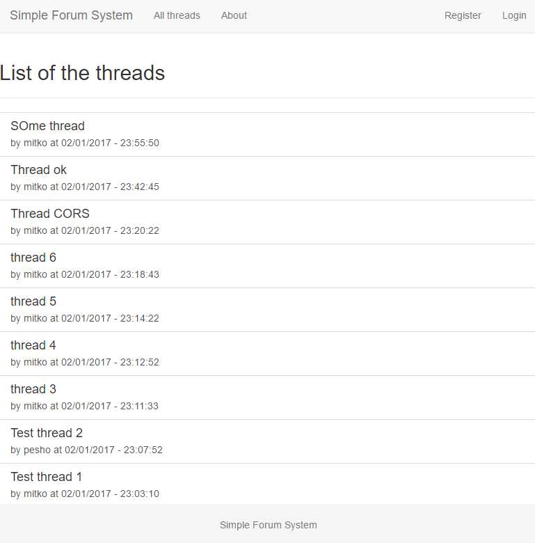
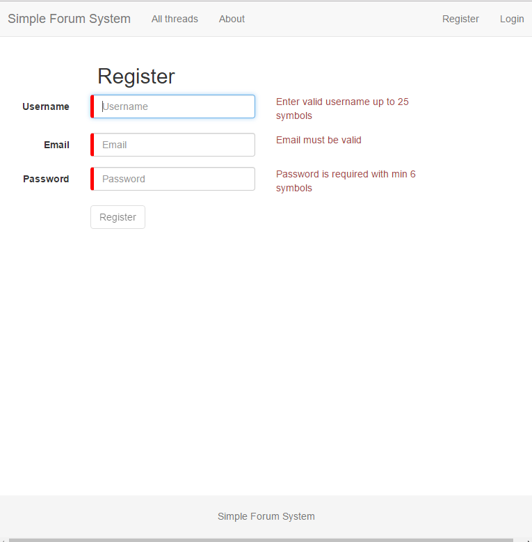
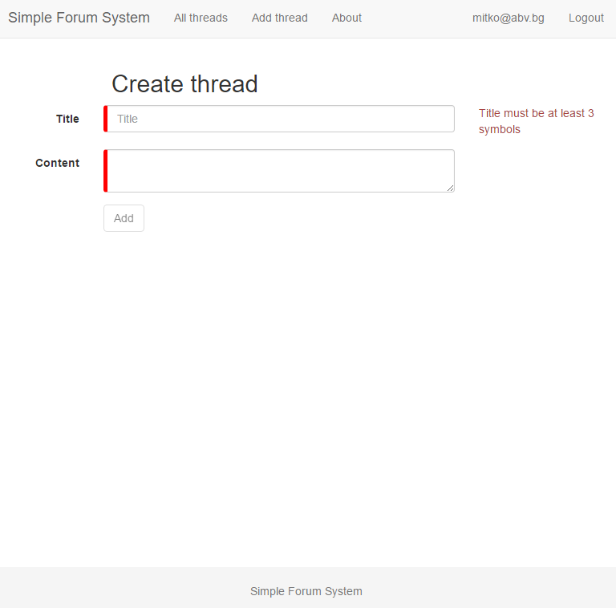
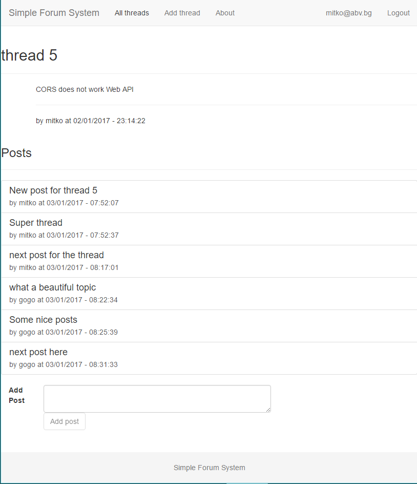

# Course project for SPA Applications with Angular 2 course at Telerik Academy
----------------------------------

##Team Directive9:

 1. Dimitar Kirov - dimkirov

##GitHub repository
https://github.com/DimitarDKirov/ForumSystemClient

##Project description
This project is a simple forum application in Angular 2. It is intended to work with Rest Web Api server available on Github https://github.com/DimitarDKirov/Forum-Paulo-Coelho.
Unregistered users are able to see all threads available in the system:

On click on a thread, the user will see all posts added for this thread.
Users may also register or login:

Registered users are able to create new thread:

And also leave a post on a thread:

